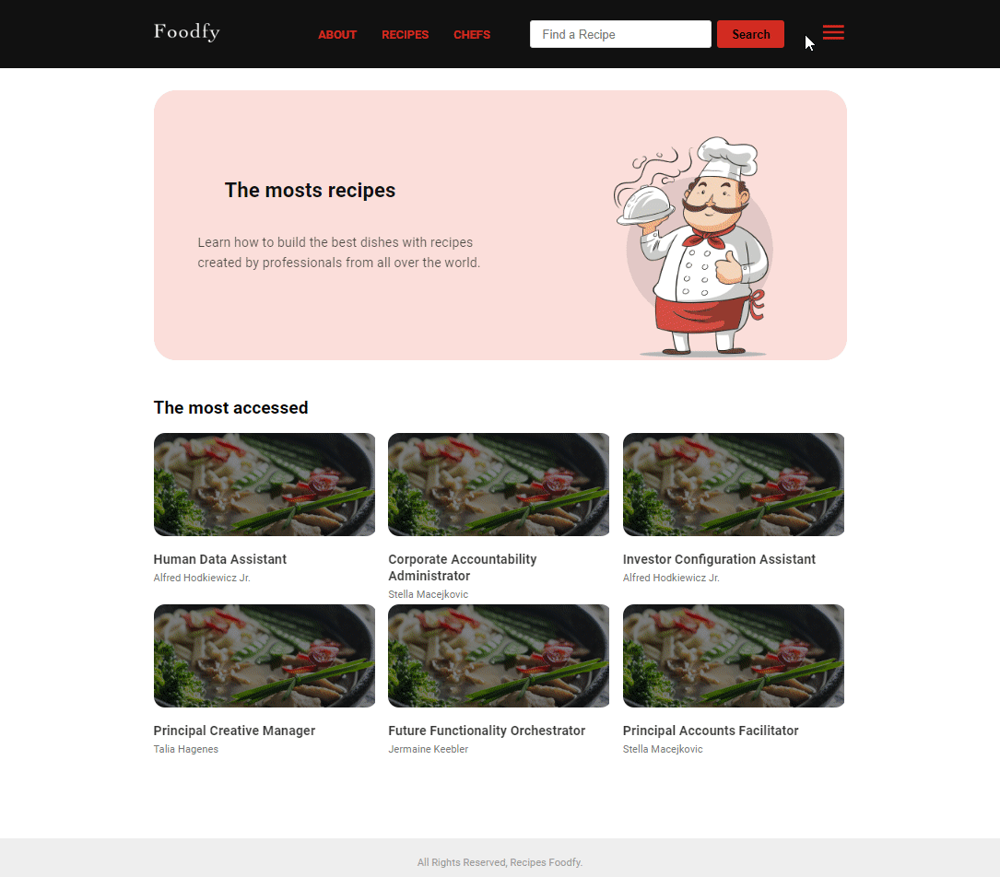
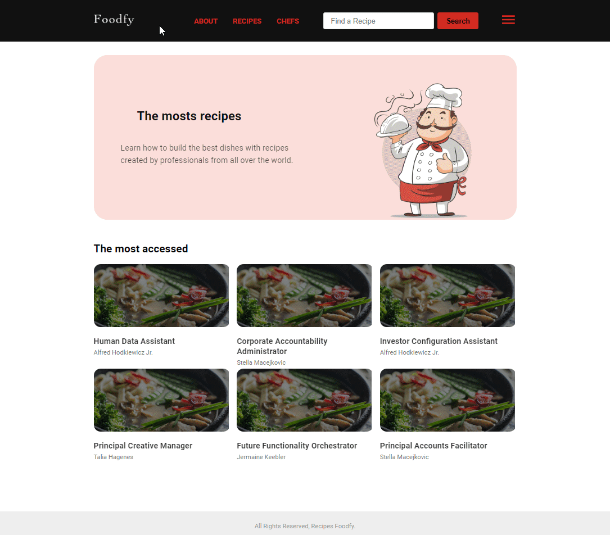

<h1 align="center">
 
  
 

 
FOODFY
</h1>

Complete website for a recipes company called Foodfy.

  

  
  

## Features

This webpage all the latest tools and practices in web development!

- 💹 **Node Js** — A web framework for Node Js.
- 🛢️ **PostgresSql** — PostgreSQL is a powerful, open source object-relational database.
- 📕 **Html** — HTML is the standard markup language for Web pages.
- 📘 **CSS** — CSS is a language that describes the style of an HTML document.
- 💻 **JavaScript** — JavaScript is the programming language of HTML and the Web.

## Getting started

Describe here the way to use/install your project

1. Clone this repo using `git clone git@github.com:Laerciosantosn/LauchBase-FoodFy.git`
2. Move yourself to the appropriate directory: `cd Foodfy` 
3. Run `code .` to open project in VsCode 

#### Getting started with the backend server

1. Run `npm install` to install the packages dependecies
2. Import the file databse `foodfy.sql`
3. Run the `seed.js` file to create date in your database.

#### Getting started with the frontend

1. Run `npm start` to start the web application
2. In your browser open `http://localhost:3000` to start the web application
3. To login with the Admin user : `E-mail: admin@foodfy.com` and `Password: admin`
4. To login with the Profile user : `E-mail: profile@foodfy.com` and `Password: profile`

## License

This project is licensed under the MIT License - see the [LICENSE](https://opensource.org/licenses/MIT) page for details.